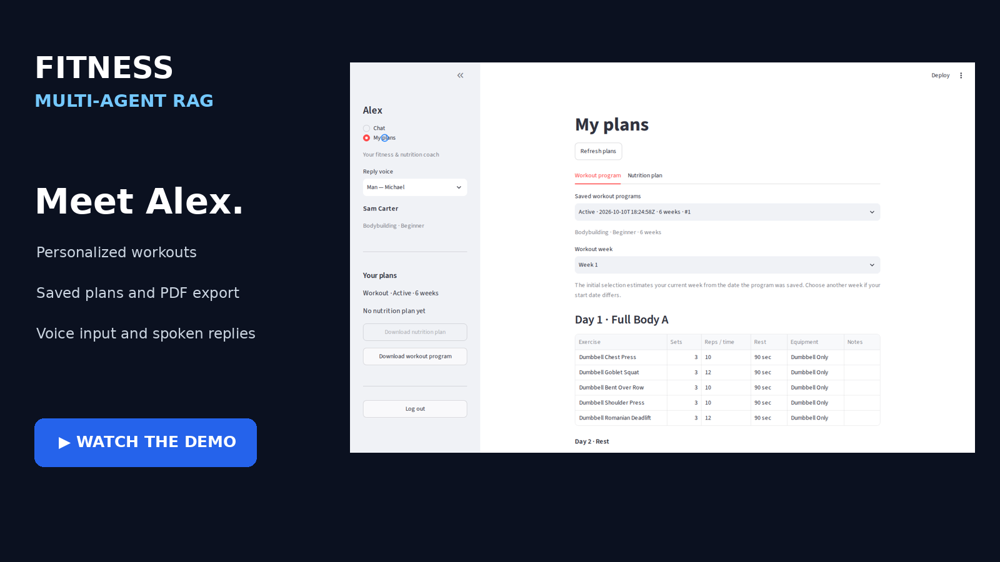
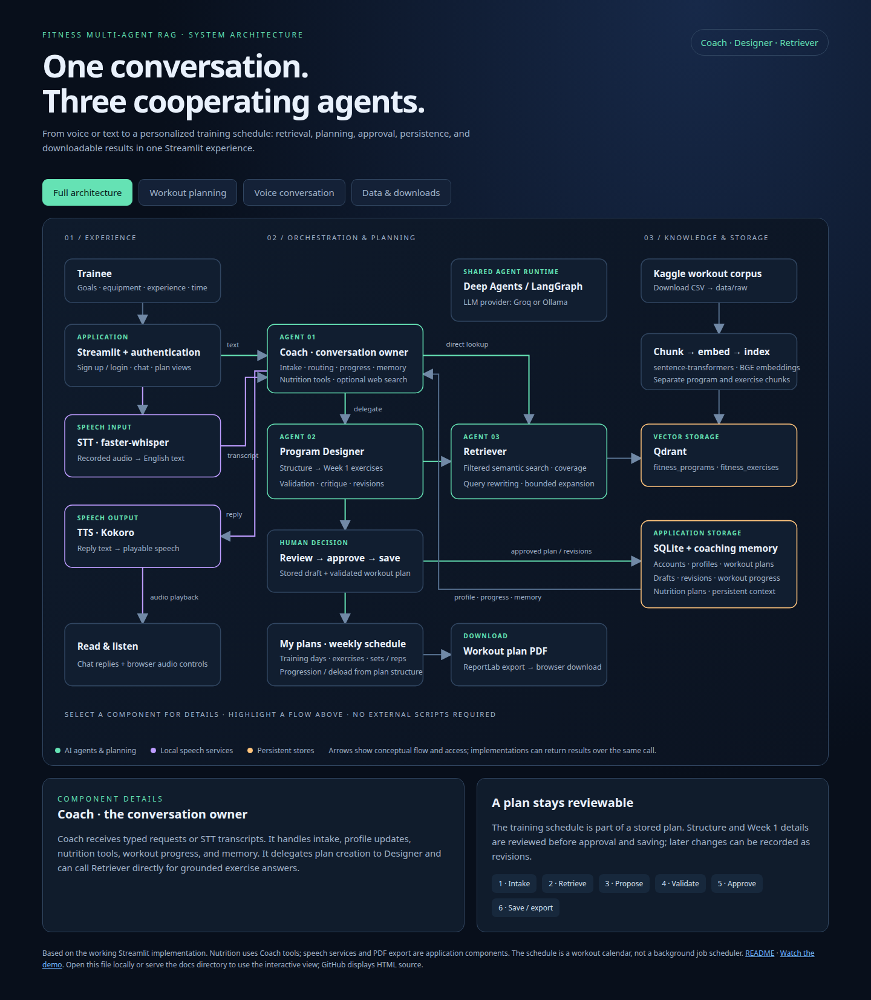

# Fitness Multi-Agent RAG

A personalized fitness coaching application with a Streamlit interface, three cooperating AI agents, retrieval-grounded workout planning, persistent coaching context, nutrition planning, and local speech input/output.

[](https://raw.githubusercontent.com/bmaged23/Fitness_multiagent_RAG/master/docs/media/fitness-coach-demo.mp4)

**4:54 narrated walkthrough:** login → coaching chat → plan structure → Week 1 exercises → approval and saving → weekly schedule → PDF download → STT → spoken reply → nutrition approval → both PDF downloads → open and scroll the documents.

[Watch/download the demo](https://raw.githubusercontent.com/bmaged23/Fitness_multiagent_RAG/master/docs/media/fitness-coach-demo.mp4) · [Recording notes](docs/demo-recording.md) · [Interactive architecture diagram](docs/architecture.html)

[Browser player](docs/demo.html) · [GitHub video publishing instructions](docs/video-publishing.md)

The video link opens the raw MP4 to avoid GitHub’s file-preview error. For an inline GitHub player, upload the MP4 as a README attachment using the linked instructions.

## How it works

[](docs/architecture.html)

Open the HTML file locally for clickable explanations and flow filters. GitHub shows the static image above.

- **Coach:** handles trainee intake, coaching conversation, profile/progress tools, nutrition plans, and delegation.
- **Program Designer:** proposes training structure, generates Week 1 exercises, validates plans, and supports approval, persistence, and revisions.
- **Retriever:** searches program and exercise collections in Qdrant, checks coverage, and expands retrieval when needed. Both Coach and Designer can delegate to it.
- **Voice:** faster-whisper transcribes recorded audio; Kokoro generates audio from replies.
- **Storage and exports:** SQLite holds profiles, plans, revisions, progress, and coaching memory; Streamlit displays schedules and exports workout PDFs.

Deep Agents/LangGraph orchestrates the agents. Groq or Ollama supplies the language model; sentence-transformers supplies local embeddings. Nutrition is handled through Coach tools, not a separate nutrition agent. Weekly schedules belong to workout plans, not a background scheduling service.

## Clone and run

Use **Linux or WSL2**, Git, Python **3.12**, and Docker with Docker Compose. The pinned environment includes Linux NVIDIA CUDA 12.6 packages; full GPU speech needs a compatible NVIDIA driver. Native Windows and macOS require a different hardware dependency set. Terminal authentication imports Unix `termios` and `tty`.

`requirements.txt` is the exact installed package snapshot used for the demo, including transitive dependencies, Streamlit, Ollama, PDF export, Whisper STT, and Kokoro TTS. That environment used Python 3.13.16, but Kokoro and Misaki declare Python below 3.13: use Python 3.12 for a fresh installation. A clean Python 3.12 installation has not yet been verified. Dataset downloader dependencies are separately pinned in `requirements-data.txt` because Kaggle was absent from the demo environment.

### 1. Clone and install

```bash
git clone https://github.com/bmaged23/Fitness_multiagent_RAG.git
cd Fitness_multiagent_RAG
python3.12 -m venv .venv
source .venv/bin/activate
python -m pip install --upgrade pip
python -m pip install -r requirements.txt
python -m pip check
cp .env.example .env
```

The speech and PDF packages are already included; installing their separate requirements files is unnecessary. Package installation and model downloads require internet access and sufficient disk space for CUDA libraries and model weights. See the [official PyTorch installation options](https://pytorch.org/get-started/previous-versions/) for the CUDA wheel index.

### 2. Configure `.env`

Edit the copied `.env` locally. Never commit API keys.

| Setting | Purpose |
| --- | --- |
| `LLM_PROVIDER` | `groq` or `ollama` |
| `GROQ_API_KEY`, `GROQ_MODEL` | Required when using Groq; choose a model available to your account |
| `OLLAMA_BASE_URL`, `OLLAMA_MODEL`, `OLLAMA_API_KEY` | The example uses Ollama cloud; cloud needs a key and accessible model |
| `QDRANT_URL` | Local Compose service: `http://localhost:6333` |
| `EMBEDDING_MODEL`, `EMBEDDING_DIM` | Defaults: `BAAI/bge-large-en-v1.5`, `1024`; keep the vector size consistent |
| `KAGGLE_USERNAME`, `KAGGLE_KEY` | Needed for the dataset download in step 4 |
| `TAVILY_API_KEY` | Enables optional web-search tools |

For a local Ollama server, set `OLLAMA_BASE_URL=http://localhost:11434`, choose an installed model in `OLLAMA_MODEL`, and leave `OLLAMA_API_KEY` empty. Install Ollama and pull that model separately before starting chat. Qdrant authentication can be supplied through `QDRANT_API_KEY` when using an authenticated server.

SQLite is configured in `config/settings.py` as `data/fitness_coach.db`; the current code does not read `SQLITE_DB_PATH` from the environment. Back up existing personal data before replacing the database.

### 3. Start storage

```bash
docker compose -f docker/docker-compose.yml up -d
docker compose -f docker/docker-compose.yml ps
curl --fail http://localhost:6333/healthz
python scripts/init_db.py
```

Compose starts Qdrant; it does not containerize Streamlit. SQLite initialization creates application tables. Qdrant vectors persist in the Compose volume; SQLite persists under `data/`.

### 4. Download and index the workout corpus

Get Kaggle credentials using the [official Kaggle CLI instructions](https://github.com/Kaggle/kaggle-cli). The downloader accepts `KAGGLE_USERNAME` and `KAGGLE_KEY`, or a configured `~/.kaggle/kaggle.json`.

```bash
python -m pip install -r requirements-data.txt
python scripts/download_dataset.py
python scripts/chunk_data.py
python scripts/embed_and_index.py --reseting
python scripts/inspect_collections.py
```

The source dataset is `adnanelouardi/600k-fitness-exercise-and-workout-program-dataset`. Downloaded CSV files go to `data/raw/`; program and exercise chunks go to `data/processed/`. Embedding downloads the configured model and fills the `fitness_programs` and `fitness_exercises` Qdrant collections. Complete indexing before asking for grounded training plans.

**Index reset behavior:** `--reseting` deletes and recreates both collections, and the script currently defaults to this behavior even without a flag. For later upserts that preserve existing collections, explicitly run:

```bash
python scripts/embed_and_index.py --no-reseting
```

### 5. Prepare speech models

```bash
python scripts/download_speech_models.py
python -c "import torch; print('Torch:', torch.__version__, 'CUDA:', torch.version.cuda, 'GPU available:', torch.cuda.is_available())"
```

This downloads English `Systran/faster-whisper-base.en` for STT and `hexgrad/Kokoro-82M` with the configured voices for TTS. Models are cached locally. The spaCy English model is pinned through its release-wheel URL in `requirements.txt`. See [faster-whisper's GPU requirements](https://github.com/SYSTRAN/faster-whisper) if CUDA or cuDNN libraries fail to load. Successful Torch GPU detection alone does not validate Whisper inference.

### 6. Launch and try the application

```bash
python -m streamlit run app/streamlit_app.py
```

Open `http://localhost:8501`. Sign up, log in, and provide your goal, experience, equipment, available days, and any training limitations. Try: “Create a six-week beginner dumbbell plan, three days per week.” Review the proposed structure, request Week 1 details, then explicitly approve saving the plan. Open **My plans** to inspect the weekly schedule and download its PDF. Nutrition plans can also be drafted, approved, and revised through chat.

Allow browser microphone access on localhost to record speech, review/send the transcription, and use the reply audio controls to hear generated speech. Voice requires the downloaded models and working GPU/runtime configuration. PDF export requires no additional package installation. The [recorded demo](https://raw.githubusercontent.com/bmaged23/Fitness_multiagent_RAG/master/docs/media/fitness-coach-demo.mp4) shows these interactions.

The terminal alternative is:

```bash
python src/fitness_multiagent_rag/agents/coach/main.py
```

Use Ctrl+C to end a terminal session and run session finalization. Stop Qdrant with `docker compose -f docker/docker-compose.yml down`; avoid `down -v` unless you intend to delete its stored vectors.

### Troubleshooting

- **Docker connection fails:** start Docker/Desktop, enable WSL integration when applicable, then rerun the storage commands.
- **Missing vectors or poor retrieval:** verify the dataset files and both collections using the indexing steps and `inspect_collections.py`.
- **Provider authentication/model errors:** check the selected provider, key, URL, and account-accessible model in `.env`.
- **Speech dependency check fails on Python 3.13:** the recorded environment has two known Python-version metadata conflicts (Kokoro and Misaki). Recreate the virtual environment with Python 3.12 rather than silently ignoring dependency checks.
- **Microphone unavailable:** grant browser permissions and access through localhost or HTTPS.
- **Port in use:** choose another Streamlit port with `--server.port 8502`.

## Project layout

```text
app/                         Streamlit UI, chat, plan views, and audio controls
config/                      Environment and runtime settings
src/fitness_multiagent_rag/
  agents/                    Coach, Designer, Retriever, prompts, and tools
  db/                        SQLite access and persisted training/nutrition data
  memory/                    Persistent coaching context
  schemas/                   Typed profiles and plans
  speech/                    Whisper STT and Kokoro TTS
  vectorstore/               Qdrant retrieval and embeddings
scripts/                     Dataset, indexing, schema, and speech-model setup
db/                          SQL schemas
docker/                      Qdrant Compose configuration
tests/                       Offline regressions and live integration runners
docs/                        Architecture, demonstration, and reference material
```

## Offline verification

```bash
PYTHONPATH=.:src python -m pytest tests/test_draft_routing.py tests/test_streamlit_app.py tests/test_speech.py tests/test_plan_pdf.py
```

These regression targets avoid live provider integration runners. `tests/test_coach.py`, `test_designer.py`, and `test_retriever.py` interact with configured external services and can write application data. No published retrieval-quality, latency, or cost benchmarks are claimed.

## Additional documentation

The original detailed design reference is preserved in [docs/reference/project-design-notes.md](docs/reference/project-design-notes.md). Historical design notes may differ from the running implementation.
